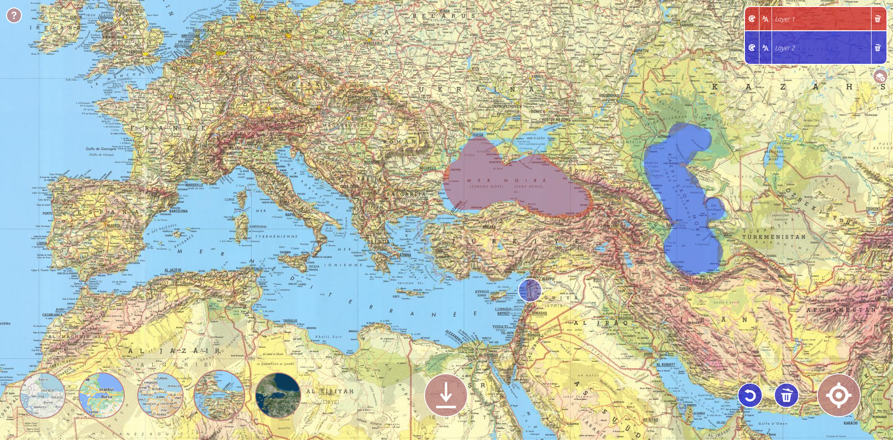
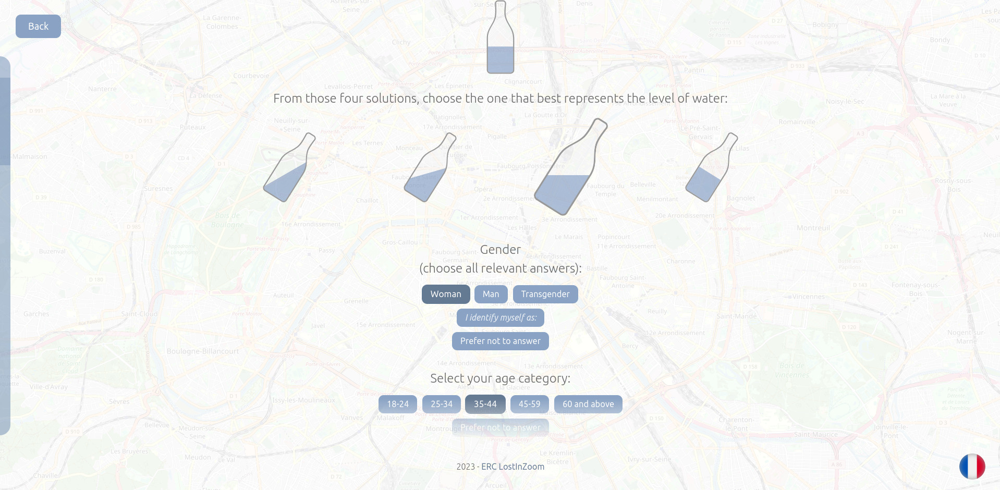
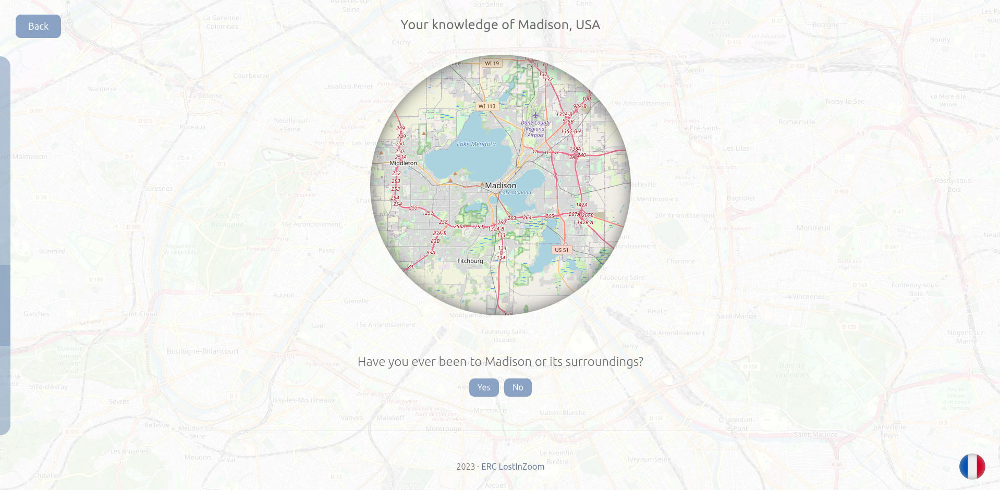
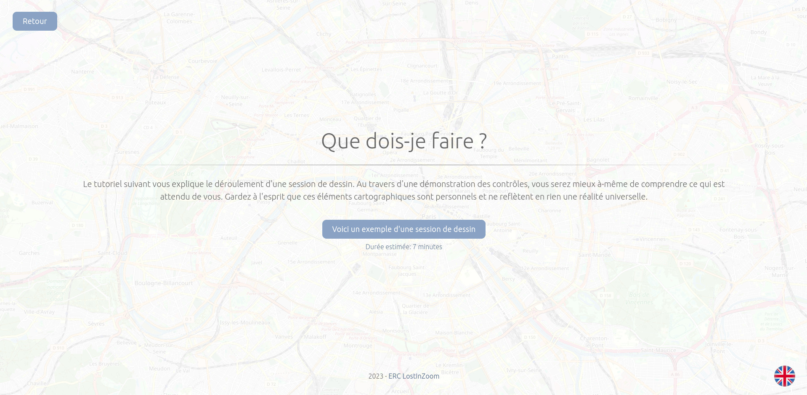

======================
LostInZoom Experiments
======================

.. Documentation at RTD — https://readthedocs.org

`LostInZoom experiments <https://github.com/LostInZoom/lostinzoom-experiments>`_ is a `Django <https://www.djangoproject.com/>`_
project which aims at providing a framework to develop and conduct scientific experiments on map navigation.

User guide available `here <https://lostinzoom-experiments.readthedocs.io/en/latest/>`_.

Deployed version available `here <https://lostinzoom.huma-num.fr>`_.

Draw on maps
^^^^^^^^^^^^

Create beautiful forms
^^^^^^^^^^^^^^^^^^^^^^

Use maps inside forms
^^^^^^^^^^^^^^^^^^^^^

Change the language on the fly
^^^^^^^^^^^^^^^^^^^^^^^^^^^^^^

