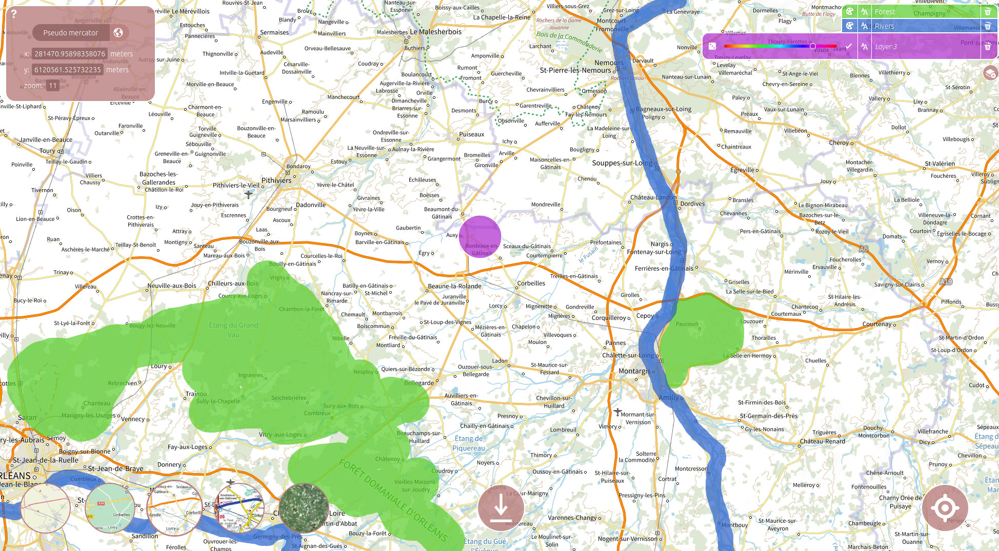

.. _Applications:

============
Applications
============

Map Draw
========

**Map Draw** is a web application designed to draw on maps and download the data in GeoJSON format.
Once installed, this tool can be easily configured to fit your needs.

Main features:
^^^^^^^^^^^^^^
 * Basemaps selection (OSM, Google, custom WMTS source)
 * Layer system with custom colors and names
 * Free drawing tool with adjustable brush size
 * GeoJSON and PNG map export

Mapdraw installation
=====================

**Map Draw** is part of the LostInZoom `Django <https://www.djangoproject.com/>`_ project which contains several other
web applications designed to conduct experiments on cartographic navigation.
Please take a look at the :ref:`installation page <Installation>` for more details.