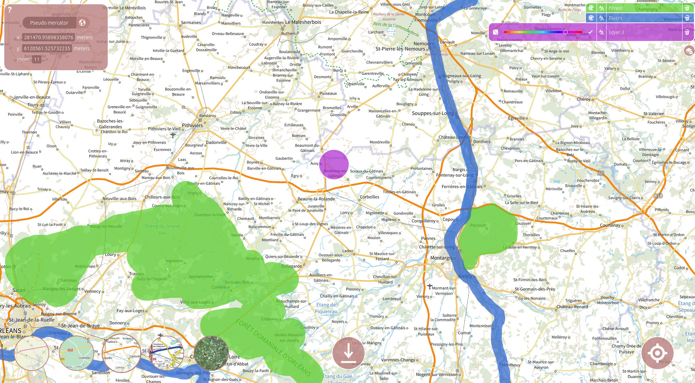

.. _Map Draw:

==========
Map Draw
==========

Presentation
==============

**Map Draw** is a web application designed to draw on maps and download the data in GeoJSON format.
Once installed, this tool can be easily configured to fit your needs.

Main features:
 * Basemaps selection (OSM, Google, custom WMTS source)
 * sdf

Installation
==============

**Map Draw** is part of the LostInZoom `Django <https://www.djangoproject.com/>`_ project which contains several other
web applications designed to conduct experiments on cartographic navigation. But don't worry, in this section, you will
learn how to install only Map Draw on your computer or remote server.

Setting up Django
------------------

Linux
^^^^^^

This installation uses **PIP** as its python package manager and **venv** to run Django inside a virtual environment::

    sudo apt install python3-pip
    sudo apt install python3-venv

Creating the virtual environment::

    python3 -m venv lizexp

Creating a new folder inside the virtual environment::

    mkdir lizexp/lizexp

**The whole Django project must be placed inside this new folder.**
    
Activating the virtual environment and moving to the app's folder::

    source lizexp/bin/activate
    cd lizexp/lizexp

Install required packages::

    pip install -r requirements.txt

If you are not using PIP, here are the python packages needed::

    django
    pymemcache
    device_detector
    user_agents

Usage
=======